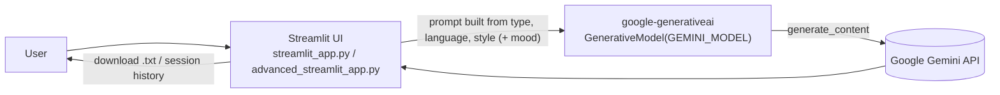

# AI Poetry Generator

A Streamlit app that writes short Pakistani-style poems (English, Urdu or Arabic) with Google Gemini. You pick a topic, a style and, in the advanced app, a mood.


This was a small early learning project (September 2025) for trying out the Gemini API and Streamlit. The Python package is still named `openai_00` from the original project scaffold. **The project does not use OpenAI.** All generation goes through Google Gemini via `google-generativeai`.

## What's in the repo

| File | What it is |
|---|---|
| `streamlit_app.py` | **Basic app.** The sidebar lets you choose a poetry type (10 preset topics, such as recursion, AI, love, nature and climate, or a custom topic with quick picks), a language (English / Arabic / Urdu) and a style (traditional, modern, romantic, philosophical, humorous). It generates the poem and offers it as a `.txt` download. |
| `advanced_streamlit_app.py` | **Multi-page app** built with `streamlit-option-menu`. It has the same generator plus a mood option. **History** keeps the last 10 poems for the session, with search, filter, download and delete. **Analytics** shows counts and bar charts of types and languages used. The **Settings** page shows setup help and can clear the history. Its "default" selectors are not saved anywhere. |
| `app.py` + `templates/index.html` | An earlier **Flask** version in which the user pastes an API key into the web page. Flask is **not** in the project dependencies, so install it separately (`uv pip install flask`) to try this version. |
| `src/openai_00/helloworld.py` | A CLI smoke test that sends one prompt to Gemini, or prints a demo message if no key is set. |

History and analytics exist only in Streamlit session state. Nothing is saved to disk or a database.

## How it works



## Getting started

Requirements: Python 3.12+ and [uv](https://docs.astral.sh/uv/). You also need a Gemini API key from [Google AI Studio](https://aistudio.google.com/app/apikey).

```bash
git clone https://github.com/Sami123d/ai_poetry_generator.git
cd ai_poetry_generator
uv sync

# create .env in the project root (it is git-ignored):
#   GEMINI_API_KEY=your-key

uv run streamlit run streamlit_app.py            # basic app
uv run streamlit run advanced_streamlit_app.py   # multi-page app
```

On Windows, `run_streamlit.bat` and `run_advanced.bat` run the same commands. Without uv, run `pip install -r requirements.txt` and then `streamlit run streamlit_app.py`.

## Environment variables

| Name | Required | Purpose |
|---|---|---|
| `GEMINI_API_KEY` | yes | Google Gemini API key. Read with `python-dotenv` from `.env` or the environment. |
| `GEMINI_MODEL` | no | Gemini model name. The default is `gemini-2.5-flash`. |

The key is never shown in the Streamlit UI. `.env` is git-ignored, no key has been committed to this repository's history, and there is no `.streamlit/secrets.toml`; `.streamlit/config.toml` holds only server and theme settings.

> The code originally called `gemini-1.5-flash`, which Google has retired. The default was changed to `gemini-2.5-flash` and can be overridden with `GEMINI_MODEL`. This change was not tested against the live API. If Google retires that model too, set `GEMINI_MODEL` to a current one.

## CI

GitHub Actions installs dependencies from `uv.lock`, runs ruff with its checks limited to syntax errors and undefined names, byte-compiles every module, and checks that the runtime dependencies import. The repository has no unit tests.

## Known limitations

- The poem is inserted into the page as HTML (`unsafe_allow_html=True`) without escaping.
- `.streamlit/config.toml` disables CORS and XSRF protection. That is acceptable for local use but should be changed before deploying anywhere.
- The Flask version's dependency (Flask) is missing from `pyproject.toml`.
